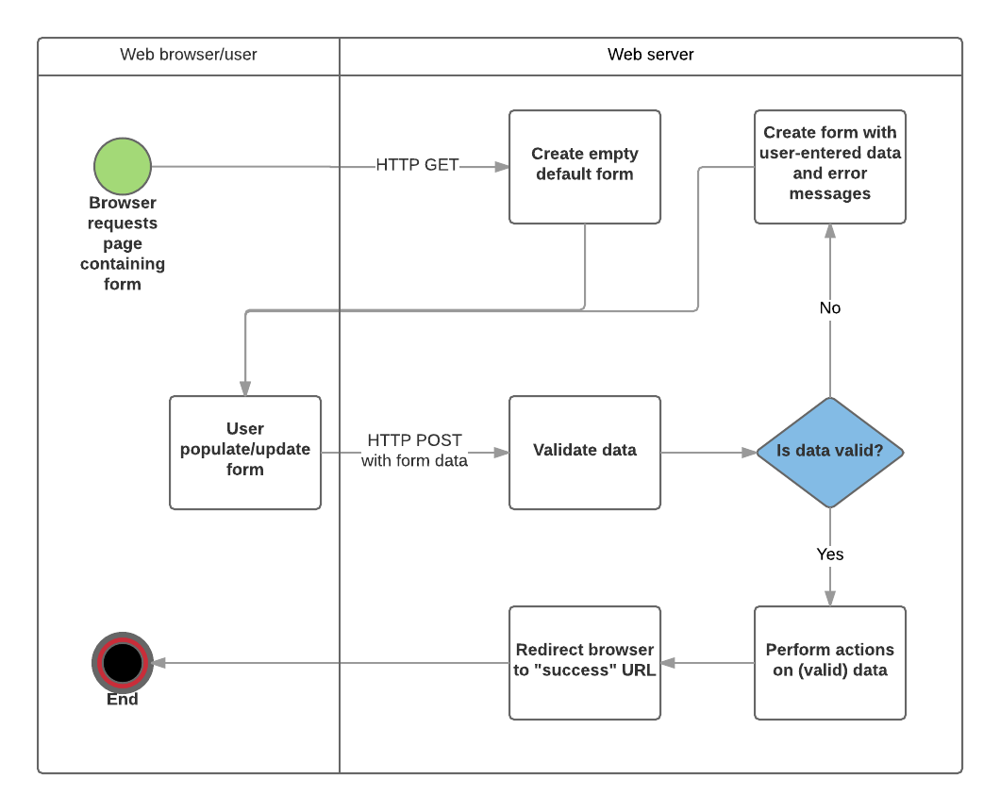

# NodeJS-Basic-Informational-Site

- localhost:8080 should take users to index.html
- localhost:8080/about should take users to about.html
- localhost:8080/contact-me should take users to contact-me.html
- 404.html should display any time the user tries to go to a page not listed above.

index.js -> using just node.js
app.js -> using express.js

# FORMS AND DATA HANDLING

